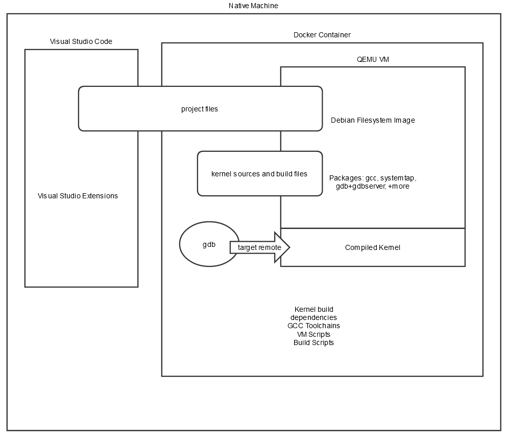

# Linux Kernel Analysis Environment

## Introduction

The goal of the Linux Kernel Analysis Environment is to provide a starting point for analysts looking at kernel bugs. 

This environment is inspired by the QEMU VM setup used by the syzkaller+syzbot project (https://github.com/google/syzkaller/blob/master/docs/linux/setup_ubuntu-host_qemu-vm_x86-64-kernel.md). The idea is to boot a QEMU VM with a debian distro on top of a custom built kernel.

The initial goals for developing this environment are:
- Easily compile and run userspace programs (ie reproducers and exploits) on top of a custom kernel
- Be able to break into and step by step debug this custom linux kernel (ideally gdb + extensions and scripts)
- Easily and quickly switch between kernel versions and configurations

Additionally, the environment should have ways to easily use existing tracing systems such as eBPF or Systemtap as supported by the kernel. (A good overview of tracing systems can be found here: https://jvns.ca/blog/2017/07/05/linux-tracing-systems/)

## Quick Guide

### Building the Docker Container
To build the default Ubuntu-based docker container:  
`docker build -t IMAGE_NAME .`

To build using a specified version of Ubuntu (for example 18.04):  
`docker build -t IMAGE_NAME --build-arg VERSION=18.04`


**Note:**  
The build script has been written for 18.04 and 20.04.  
Other Ubuntu versions will work, but not all features (namely gcc versions) will be installed.  


### Creating a Project

To create an empty project:  
`./create_env.sh PROJ_NAME image_name`

To see more options:  
`./create_env.sh -h`

**Note:**  
This environment relies on VS Code being installed with the Remote - Containers extension.


## Design Overview

The core of the environment is a Docker container with:
- kernel sources
- build dependencies (including all the available versions of gcc for the ubuntu version)
- QEMU (qemu-system-x86_64)
- `create_image.sh` script (builds a debian image, based on the one from syzbot)
- a bunch of shell scripts to automate booting the VM

All of the analysis work - compiling and debugging, interacting with the QEMU VM - is done inside the container.

However, interfacing with docker containers using as a sort of "virtual environment" the way it is being used here is rather cumbersome.

So an additional piece to the environment is Visual Studio Code with the "Remote - Container" extension used as a sort of IDE to interface with the container. It makes mounting a project directory into the container seamless, and spinning up multiple terminals easy.

If you want to use some other way to interact with the docker container, by all means do so.


Here is a high level architecture diagram of what is described above.



## Usage
### Setup

#### Basic Environment Setup
**Docker Image Setup**

Building a docker image using the Dockerfile:

Ubuntu 18.04 Version:  
```bash
docker build --build-arg VERSION=18.04 -t kernel_analysis18.04 .
```

Ubuntu 20.04 Version:  
```bash
docker build --build-arg VERSION=20.04 -t kernel_analysis20.04 .
```

**VSCode setup**

Install Visual Studio Code, and the "Remote - Containers" extension (https://marketplace.visualstudio.com/items?itemName=ms-vscode-remote.remote-containers)


Use the `create_env.sh` script to create the `devcontainer.json` for a new project:
```bash
./create_env.sh PROJ_NAME DOCKER_IMAGE_NAME
```

Once your devcontainer.json file has been generated, bring up the command palette (Ctrl+Shift+P), and search for "Remote-Containers:Rebuild and Reopen in Container"

VSCode will start a container from the specified image, install the vscode server, and mount your project workspace into the container. Any terminals that are created will be shells into the container space.

#### VM Setup

To boot a QEMU VM, you need to:
- compile a linux kernel in /kernel
- build a userspace image - this project used debian

**Building a custom Kernel**

*Manual*

To manually build a custom kernel perform the following:

    cd /kernel
    git checkout your desired kernel version
    make config (or make nconfig) and set your desired configuration (setting debug options as necessary)
    make (make -jN where in is the number of threads for a multithreaded build)

*Using the build_kernel script*

Alternatively the build_kernel script can be used to build a default configured kernel.

```bash
build_kernel [option...] 
```
When no options are passed, the latest kernel is built with a default config. This behavior can be changed with various options:

 `--kernel-config [CONFIG_FILE]` specifies an existing config file to build (will have some default features added)  
 `--kernel-version [VERSION]` speficies the kernel version to checkout and build  
 `--config-only` Only generates the .config file. Does not build the kernel to allow for additional customizations  

Examples

    build_kernel --kernel-version v4.9
        will checkout kernel version v4.9 and build a default kernel
    build_kernel --debug
        will checkout the master branch and build a default configured kernel with debugging and debug symbols enabled
    build_kernel --debug --config-only --kernel-version 2db767d9889cef087149a5eaa35c1497671fa40f
        will checkout kernel commit 2db767d9889cef087149a5eaa35c1497671fa40f, and generate a default .config file with debugging and debug symbols enabled. The kernel will not be compiled. (executing a second "build_kernel" command will finish the build)

*Notes*

Currently the build_kernel script simply adds some hard coded config options to the .config file, so immediately building the kernel (i.e. not using the --config-only option, followed by a make config) may result in the build process asking about other configuration options. Selecting the default suggestion (just hitting enter) is all that is needed to build the kernel.

If you plan to use SystemTap, the kernel build directory will need to be accessed by the SystemTap framework inside the QEMU VM. The easiest way to do this is via filesystem passthrough using the 9P Virtio filesystem ( https://www.linux-kvm.org/page/9p_virtio), which requires kernel support. Using the build_kernel script automatically configures this, and the boot_vm script described below will attempt to mount the kernel directory in the VM.

**Building the debian image**

    cd to the /image directory
    Execute ./create_image -d <debian_release>

The supported debian releases are: jessie, stretch, or buster

The kernel version and default gcc release can be important to be close to the kernel version and gcc used to build the kernel.

- Jessie: Kernel v3.16, gcc-4.9
- Stretch: Kernel v4.9, gcc-6
- Buster: Kernel v4.19, gcc-7 and gcc-8


Note: To modify which packages are installed, the create_image.sh script will need to be modified.

**Booting the VM**

The boot_vm script wraps the qemu-system-x86_64 invocation. It does some simple checks to ensure that there is a compiled kernel and debian image in the expected locations. (It will attempt to build some defaults if they are not detected.)

To boot the QEMU VM, run the following:

    export RELEASE=<debian_release>
    By default, RELEASE=buster

    boot_vm to start the VM without the QEMU gdbstub disabled
    OR
    boot_vm --debug to start the VM with the QEMU gdbstub enabled

**Additional Hints**
- Choose dependencies that are all from the same timeframe.  
  Using dependencies that are +/- too far out of sync can cause unforeseen issues.  
  For example, trying to build the latest kernel using an ubuntu 16.04 container probably won't work.  
  Similarly, trying to build an older kernel such as 3.16 or 4.4 on the latest ubuntu version will also run into issues.  
  Likewise, building a stretch or buster debian image on ubuntu 16.04 will have issues.  
  Or booting an old kernel version with a buster image might not work as expected.

- The older the kernel version, the fewer debugging options there are.  
    For example, the kernel gdb scripts were only introduced in version 4.0. You will not be able to use the scripts on an older version (without potentially backporting them)

### Debugging the kernel
**GDB**
To debug the kernel using gdb:

Launch the VM with debugging enabled (QEMU starts a gdbserver on port 1234):
```bash
boot_vm --debug
```

In another terminal, run gdb on the compiled kernel:
```bash
cd /kernel
gdb vmlinux
```

Connect to the QEMU gdbserver:
```bash
target remote :1234
```

You should see that gdb has broken into the kernel idle loop (assuming not a whole lot was running at the time gdb connected)  
At this point you can set breakpoints on kernel functions and view variables in the current context.

For kernels 4.0+ GDB provides scripts that can help with analyzing the kernel:
```
gdb> apropos lx
```

**SystemTap**

If you are analyzing a kernel lower than 5.0, then you can also use SystemTap to trace the kernel.

### Debugging userspace
While debugging userspace programs is not the goal of this project, sometimes it is useful to debug a proof of concept or other program which might not be performing as expected in the VM.

`gdbserver` is installed in the debian image by default.  
So to debug a userspace program, you can run the program under gdbserver using port 1234.

QEMU forwards port 1234 to 5678 in the container, so running gdb remote from container and attaching to port 5678 will allow for debugging of a userspace program in the QEMU VM running the custom kernel.


### Analysis Scripts

The /analysis_scripts directory is automatically added to the PATH in the container, containing these scripts
- build_kernel  
A script to automate some defaults for building a custom kernel

- boot_vm
A script wrapping a QEMU invocation to boot the custom kernel with a debian userspace image with filesharing

- launch_debug_session  
A script to launch a tmux session with a booted VM and connected SSH and GDB sessions

- ssh_vm
A ssh wrapper script to ssh into the QEMU VM

- send_to_vm
A scp wrapper script to send files to the QEMU VM

- update_fstab
A script to modify the debian image to allow for filesystem sharing changes.


## OtherResources

#### Docker Container Usage

https://code.visualstudio.com/docs/remote/containers

https://code.visualstudio.com/docs/remote/containers-advanced


#### Kernel Debugging

https://www.kernel.org/doc/html/latest/dev-tools/gdb-kernel-debugging.html

https://www.kernel.org/doc/html/latest/dev-tools/kgdb.html

https://nickdesaulniers.github.io/blog/2018/10/24/booting-a-custom-linux-kernel-in-qemu-and-debugging-it-with-gdb/


#### QEMU filesystem sharing

https://www.linux-kvm.org/page/9p_virtio


#### Syzkaller

https://github.com/google/syzkaller

https://github.com/google/syzkaller/blob/master/tools/create-image.sh

https://github.com/google/syzkaller/blob/master/vm/qemu/qemu.go


#### SystemTap

https://blog.lexfo.fr/cve-2017-11176-linux-kernel-exploitation-part1.html

https://jvns.ca/blog/2017/07/05/linux-tracing-systems/


### Notes and Troubleshooting
- To use older debian distros (stretch and jessie) "CONFIG_FHANDLE=y" needs to be in the kernel config (gets added automatically in the build_kernel script

- GDB and SystemTap don't play well together. probably because system tap is using kprobes which dynamically modify the assembly...which is what a debugger does too.

- probes on an inlined function will not show the parameters to the function call (only question marks).

- The QEMU GDB stub doesn't work perfectly with the kernel so sometimes breakpoints you might expect to trigger won't.